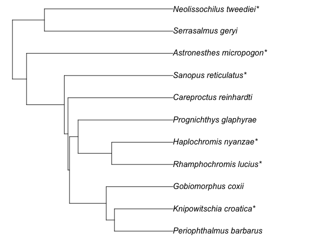
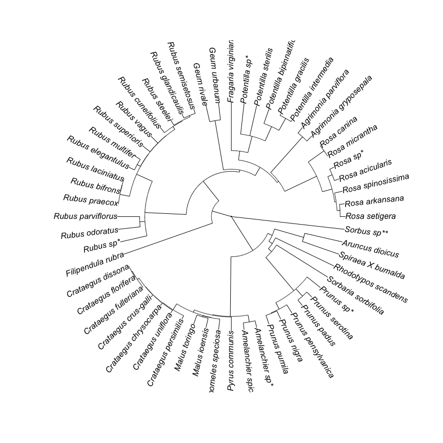

<!-- README.md is generated from README.Rmd. Please edit that file -->

# rtrees

The goal of `rtrees` is to remove the barriers to derive phylogenies for
a list of species from mega-trees. Basically, `Phylomatic` and more.

# Installation

``` r
devtools::install_github("daijiang/rtrees")
```

``` r
library(rtrees)
library(ape)
```

# Mega-trees

Currently, `rtrees` provides mega-trees for four taxon groups: plants,
fishes, birds, and
mammals.

| Taxon  | Mega\_tree                                           | Reference                                              |
| :----- | :--------------------------------------------------- | :----------------------------------------------------- |
| Plant  | `tree_plant_otl` (74,531 tips)                       | Open Tree of Life, Smith & Brown 2018; Jin & Qian 2019 |
| Fish   | `tree_fish` (11,638 tips)                            | Fish Tree of Life, Rabosky et al. 2018                 |
| Bird   | `tree_bird_ericon`, `tree_bird_hackett` (9,993 tips) | Bird Tree of Life, Jetz et al. 2018                    |
| Mammal | `tree_mammal` (5,831 tips)                           | PHYLACINE, Faurby et al. 2018                          |

# Usage examples

The species lists which we want to have a phylogeny should be provided
as a data frame with at least 3 columns: `family`, `genus`, and
`species`. Their order does not matter. Here is an example for fish.

``` r
test_fish_list
#> # A tibble: 12 x 3
#>    species                 genus          family        
#>    <chr>                   <chr>          <chr>         
#>  1 Serrasalmus_geryi       Serrasalmus    Serrasalmidae 
#>  2 Careproctus_reinhardti  Careproctus    Liparidae     
#>  3 Gobiomorphus_coxii      Gobiomorphus   Eleotridae    
#>  4 Periophthalmus_barbarus Periophthalmus Gobiidae      
#>  5 Prognichthys_glaphyrae  Prognichthys   Exocoetidae   
#>  6 Barathronus_bicolor     Barathronus    Aphyonidae    
#>  7 Knipowitschia_croatica  Knipowitschia  Gobiidae      
#>  8 Rhamphochromis_lucius   Rhamphochromis Cichlidae     
#>  9 Neolissochilus_tweediei Neolissochilus Cyprinidae    
#> 10 Haplochromis_nyanzae    Haplochromis   Cichlidae     
#> 11 Astronesthes_micropogon Astronesthes   Stomiidae     
#> 12 Sanopus_reticulatus     Sanopus        Batrachoididae
```

For plant, fish, bird, and mammal, it is possible to prepare `sp_list`
with function `sp_list_df()`; though you should check the results. It is
possible to just provide the speices as a character vector for these
taxon groups (or all genus in your species list are presented in the
phylogeny).

``` r
sp_list_df(sp_list = c("Periophthalmus_barbarus", "Barathronus_bicolor"),
           taxon = "fish")
#> # A tibble: 2 x 3
#>   species                 genus          family    
#>   <chr>                   <chr>          <chr>     
#> 1 Periophthalmus_barbarus Periophthalmus Gobiidae  
#> 2 Barathronus_bicolor     Barathronus    Aphyonidae
```

Then we can derive a phylogeny from `tree_fish`.

``` r
test_tree = get_tree(sp_list = test_fish_list,
                     tree = tree_fish, # either 
                     taxon = "fish", # or
                     scenario = "S1",
                     show_grafted = TRUE)
#> These species have no species in the same family in the mega-tree, skipped: 
#> Barathronus_bicolor
plot(ladderize(test_tree), no.margin = T)
```



## Add tips to user provided trees

It is also possible to derive a phylogeny based on a user provided tree.
This can be particularly useful if we have things like `Acer_spp` that
we want to insert to the basal node of the
genus.

``` r
test_tree = ape::read.tree(text = "(((((((((Potentilla_intermedia:1.156097,Potentilla_gracilis:1.156097):9.169741,Potentilla_bipinnatifida:10.325839):10.466967,Potentilla_sterilis:20.792806):11.333216,Fragaria_virginiana:32.126022):6.026567,(((((Rosa_setigera:3.434279,Rosa_arkansana:3.434279):1.991106,Rosa_spinosissima:5.425386):0.993924,Rosa_acicularis:6.419309):6.730804,(Rosa_micrantha:0.188519,Rosa_canina:0.188519):12.961594):23.677485,(Agrimonia_gryposepala:4.730863,Agrimonia_parviflora:4.730863):32.096735):1.324992):6.47604,(Geum_urbanum:11.153303,Geum_rivale:11.153303):33.475326):1.449852,((((((((Rubus_semisetosus:3.10529,Rubus_glandicaulis:3.10529):0.957584,Rubus_steelei:4.062873):0.398394,Rubus_cuneifolius:4.461267):2.271628,Rubus_vagus:6.732895):0.023439,Rubus_superioris:6.756333):0.020104,(Rubus_multifer:4.287114,Rubus_elegantulus:4.287115):2.489323):0.025475,((Rubus_laciniatus:0.125186,Rubus_bifrons:0.125186):0.11903,Rubus_praecox:0.244216):6.557697):11.571849,(Rubus_parviflorus:14.85915,Rubus_odoratus:14.85915):3.514612):27.704718):16.915234,Filipendula_rubra:62.993714):13.354116,((((((((((Crataegus_dissona:0.081863,Crataegus_florifera:0.081863):0.49838,Crataegus_fulleriana:0.580243):1.434261,Crataegus_crus-galli:2.014503):0.177737,Crataegus_chrysocarpa:2.192239):0.051159,Crataegus_uniflora:2.243399):0.438351,Crataegus_persimilis:2.68175):4.697259,((Malus_toringo:6.472694,Malus_ioensis:6.472693):0.772012,Chaenomeles_speciosa:7.244705):0.134305):1.72489,Pyrus_communis:9.1039):0.313393,Amelanchier_spicata:9.417293):40.039557,((((((Prunus_pumila:6.189944,Prunus_nigra:6.189945):0.37487,Prunus_pensylvanica:6.564815):4.856241,(Prunus_padus:4.816999,Prunus_serotina:4.817):6.604057):29.162527,Sorbaria_sorbifolia:40.583584):2.924475,Rhodotypos_scandens:43.50806):2.718224,(Spiraea_X_bumalda:25.921582,Aruncus_dioicus:25.921583):20.304701):3.230567):26.89098);")

test_tree_sp = c("Rosa_sp", "Rubus_sp", "Amelanchier_sp", "Prunus_sp", "Sorbus_sp", "Potentilla_sp",
  "Potentilla_intermedia", "Potentilla_gracilis", "Potentilla_bipinnatifida", "Potentilla_sterilis", "Fragaria_virginiana", "Rosa_setigera", "Rosa_arkansana", "Rosa_spinosissima", "Rosa_acicularis", "Rosa_micrantha", "Rosa_canina", "Agrimonia_gryposepala", "Agrimonia_parviflora", "Geum_urbanum", "Geum_rivale", "Rubus_semisetosus", "Rubus_glandicaulis", "Rubus_steelei", "Rubus_cuneifolius", "Rubus_vagus", "Rubus_superioris", "Rubus_multifer", "Rubus_elegantulus", "Rubus_laciniatus", "Rubus_bifrons", "Rubus_praecox", "Rubus_parviflorus", "Rubus_odoratus", "Filipendula_rubra", "Crataegus_dissona", "Crataegus_florifera", "Crataegus_fulleriana", "Crataegus_crus-galli", "Crataegus_chrysocarpa", "Crataegus_uniflora", "Crataegus_persimilis", "Malus_toringo", "Malus_ioensis", "Chaenomeles_speciosa", "Pyrus_communis", "Amelanchier_spicata", "Prunus_pumila", "Prunus_nigra", "Prunus_pensylvanica", "Prunus_padus", "Prunus_serotina", "Sorbaria_sorbifolia", "Rhodotypos_scandens", "Spiraea_X_bumalda", "Aruncus_dioicus")

plot(get_tree(sp_list = test_tree_sp, tree = test_tree, taxon = "plant",
              show_grafted = T, tree_by_user = T), type = "fan")
```


It is also possible to specify a particular speices to bind with.

``` r
test_tree_sp_df = sp_list_df(test_tree_sp, "plant")
test_tree_sp_df$close_sp = NA
test_tree_sp_df$close_sp[1] = "Rosa_acicularis" # bind Rosa_sp to here
plot(get_tree(sp_list = test_tree_sp_df, tree = test_tree, taxon = "plant",
              show_grafted = T, tree_by_user = T), type = "fan")
```



Some notes:

  - If `tree` is specified, then `taxon` can be ignored if all genus in
    the species list are presented in the phylogeny.
  - If a species does not have a co-family species in the mega-tree, it
    will be skipped.
  - If `show_grafted = TRUE`, species that are grafted will have one or
    two `*` at the end of their names.
      - If it is grafted at the genus level, one `*`.
      - If it is grafted at the family level, two `*`s.
  - The default scenario is `S1`, which will graft species at the
    genus/family basal node.
      - `S2` will randomly select a downstream node to attach the new
        tip.
      - `S3` will graft the new tip above the genus/family basal node if
        no co-family species found.
      - If only one species in the mega-tree that is in the same
        genus/family of the new tip, then the new tip will be grafted at
        the middle of this species’ branch for all scenarioes.
  - The `tree` can be a user provided tree, if so, set `tree_by_user =
    TRUE`.
  - See `?get_tree` for more details.

This package is still in very early stage. Feel free to test it.
Contributions and suggestions are welcome.
